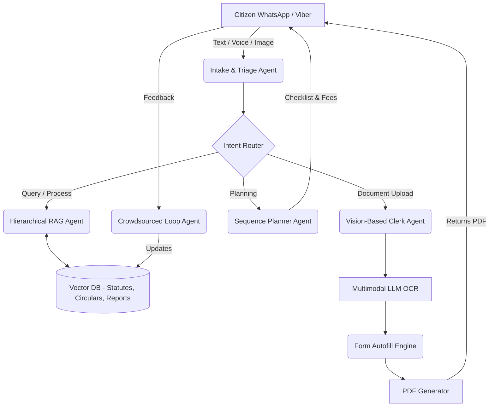
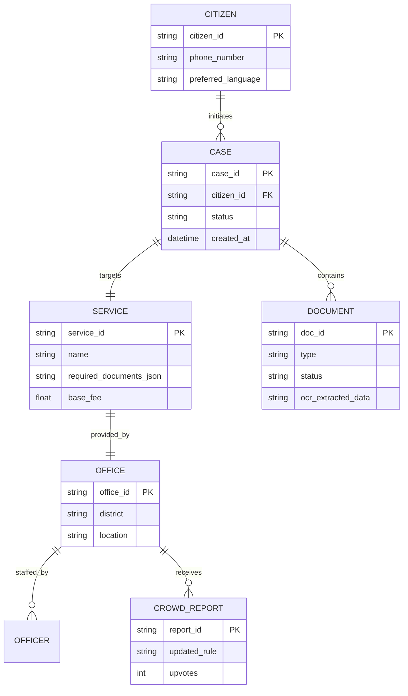
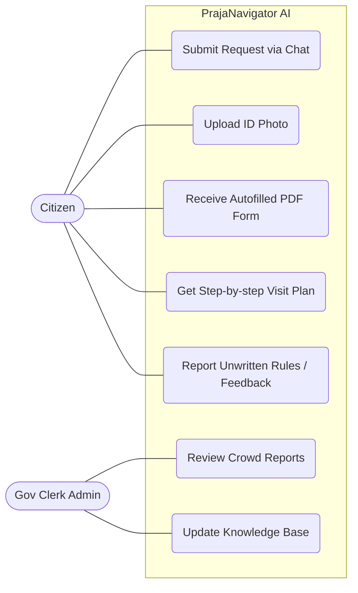

# PrajaNavigator AI Diagrams
*Copy and paste these into a Mermaid live editor (like mermaid.live) or directly into markdown files that support Mermaid rendering. They can also be embedded directly in your GitHub README.*

## 1. Architecture Diagram

## 2. Entity Relationship (ER) Diagram

## 3. Use-Case Diagram

