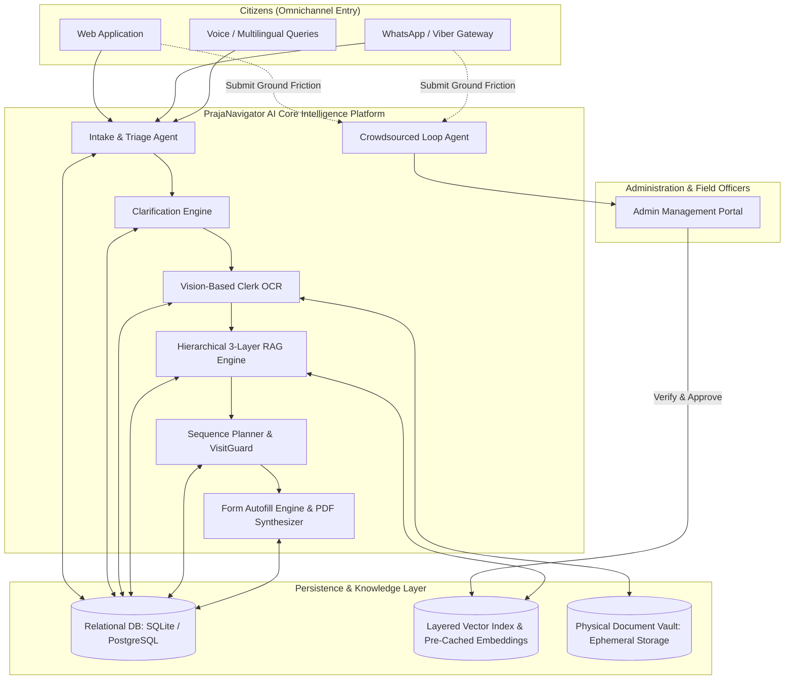
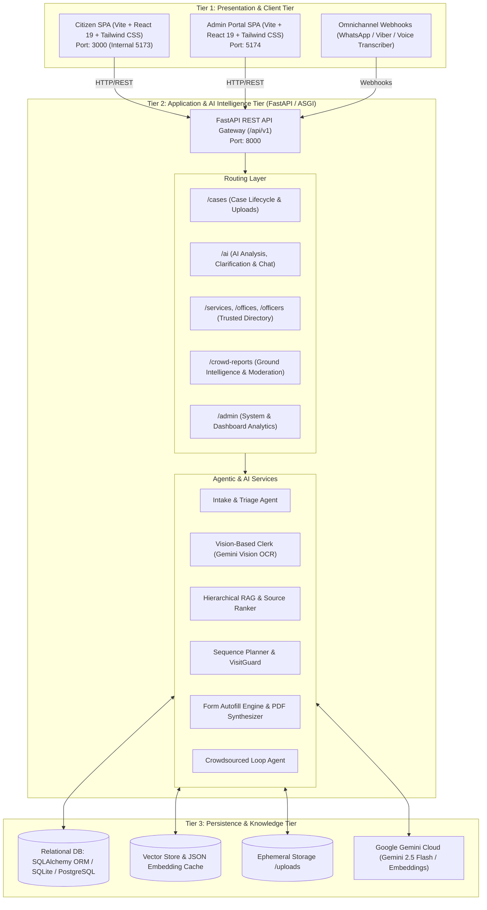
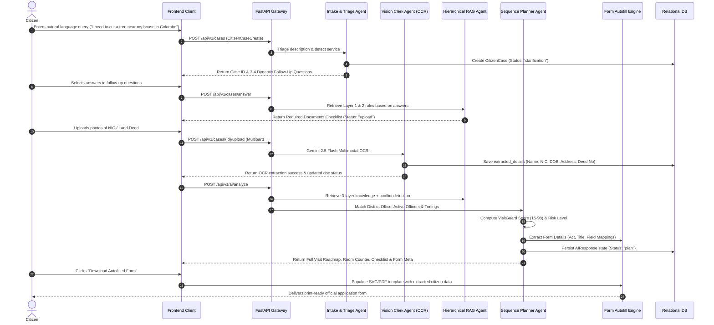
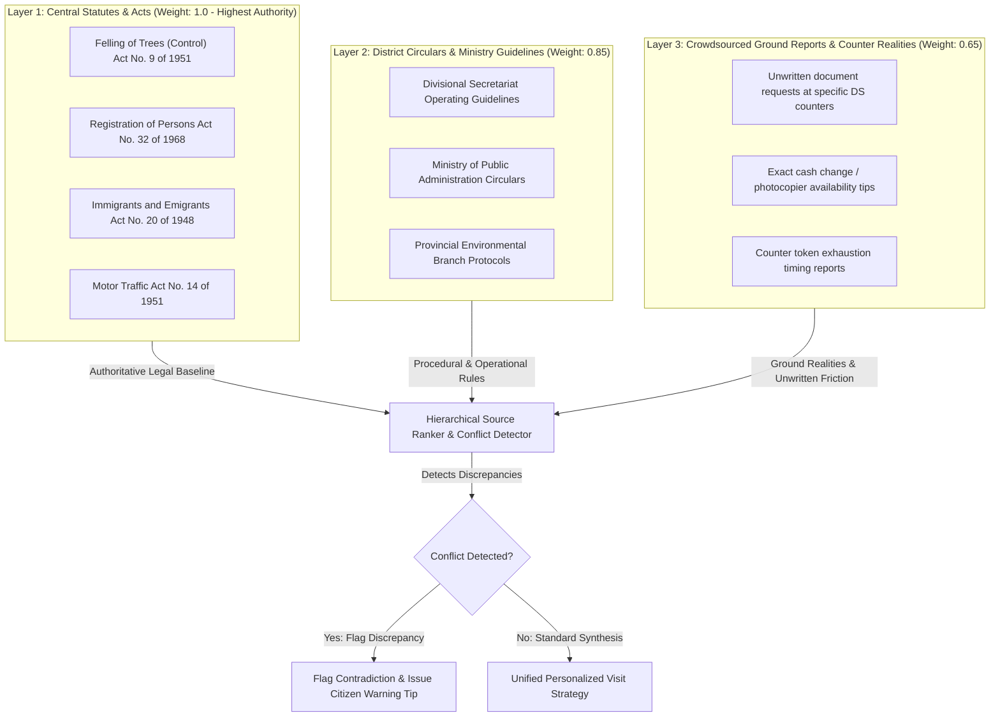
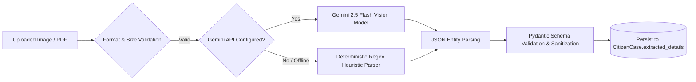
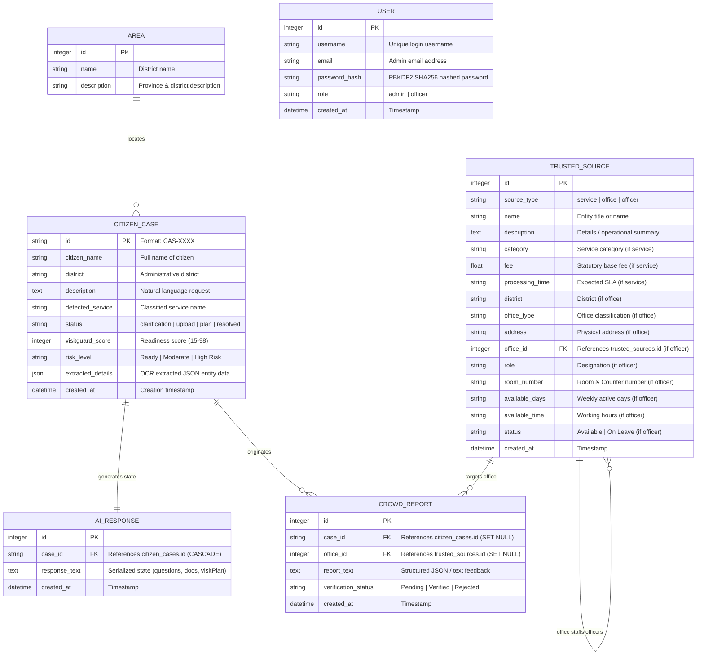
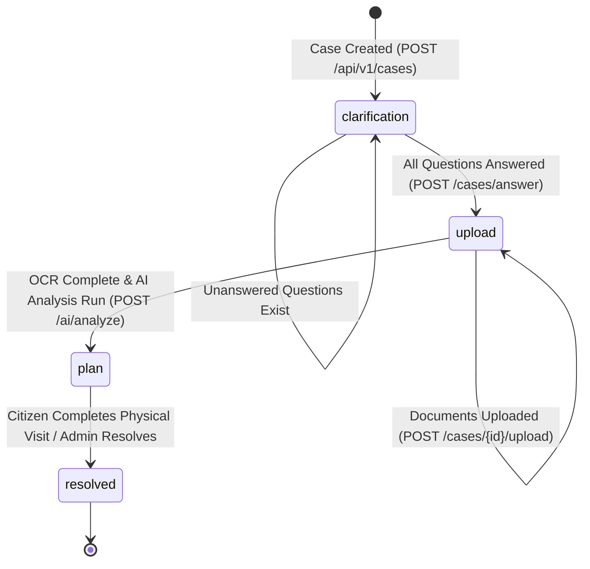
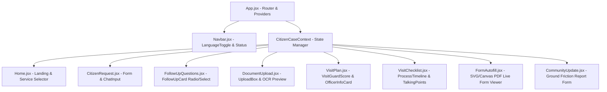
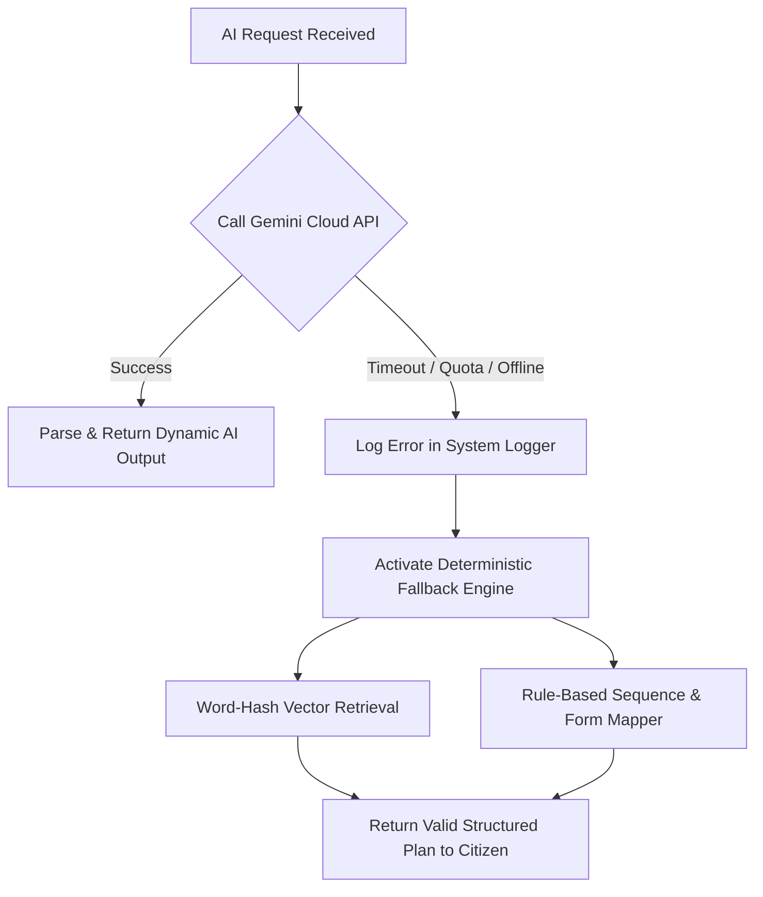
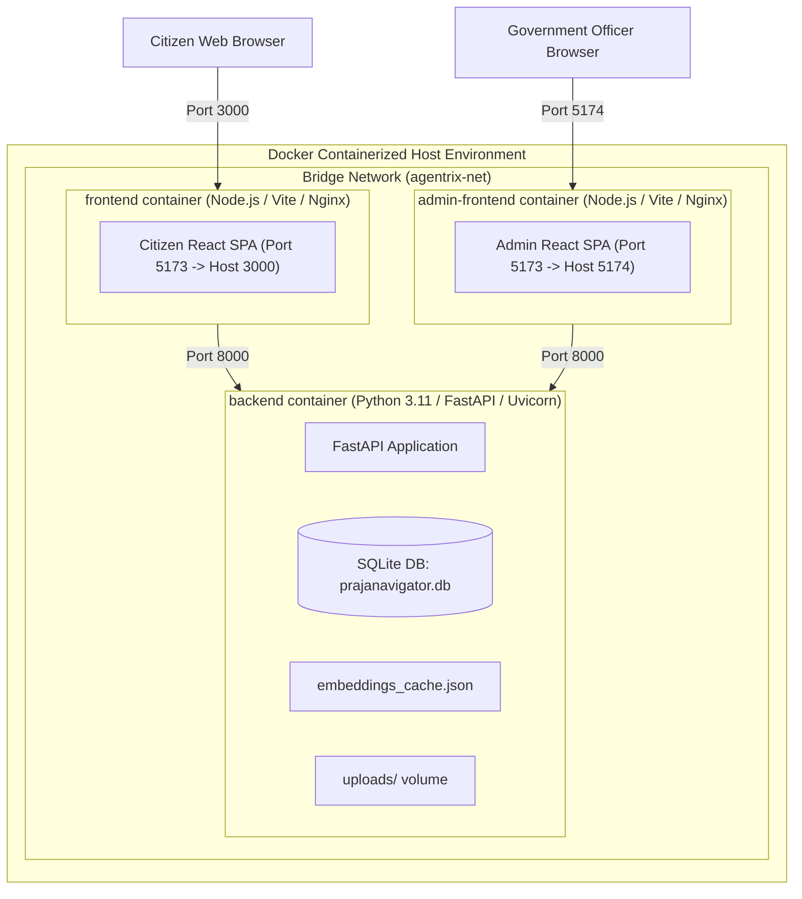

# Software Architecture Document (SAD)
## PrajaNavigator AI — Autonomous Citizen-Centric Public Administration Intelligence Layer

---

### Document Information
- **Project Name:** PrajaNavigator AI (AGENTRIX26 - TEAM21 - QuadNova)
- **Document Version:** 1.0.0
- **Document Status:** Approved Architecture Baseline
- **Date:** August 2026
- **Domain:** Sri Lanka Government & Citizen Services / Public Administration Intelligence
- **Target Audience:** Software Architects, AI/ML Engineers, Full-Stack Developers, Security Officers, Government & Public Sector Technical Evaluators

---

## Table of Contents
1. [Executive Summary & Problem Statement](#1-executive-summary--problem-statement)
2. [Architectural Goals & Quality Attributes (ISO/IEC 25010)](#2-architectural-goals--quality-attributes-isoiec-25010)
3. [System Topology & High-Level 3-Tier Architecture](#3-system-topology--high-level-3-tier-architecture)
4. [Multi-Agent Orchestration & Workflow Engine](#4-multi-agent-orchestration--workflow-engine)
5. [Hierarchical RAG (Retrieval-Augmented Generation) Subsystem](#5-hierarchical-rag-retrieval-augmented-generation-subsystem)
6. [Vision & Multimodal OCR Subsystem](#6-vision--multimodal-ocr-subsystem)
7. [Data Architecture & Persistence Layer](#7-data-architecture--persistence-layer)
8. [API Architecture & Interface Specifications](#8-api-architecture--interface-specifications)
9. [Frontend Client Architecture](#9-frontend-client-architecture)
10. [Security, Privacy & Reliability Architecture](#10-security-privacy--reliability-architecture)
11. [Deployment, Containerization & DevOps Architecture](#11-deployment-containerization--devops-architecture)
12. [Architectural Decision Records (ADRs)](#12-architectural-decision-records-adrs)

---

## 1. Executive Summary & Problem Statement

### 1.1 Context & Problem Statement
Accessing public administrative services across Sri Lanka (e.g., National Identity Card renewals, Land Deed transfers, Tree Felling permits, Passport applications, Business registrations) poses severe challenges to citizens due to:
1. **Acute Information Asymmetry:** Exact circulars, prerequisite documents, statutory fees, and specific counter locations are dispersed across departmental silos or unpublished.
2. **Unwritten Ground Realities:** Regional Divisional Secretariats (DS offices) frequently mandate undocumented local prerequisites (e.g., specific Grama Niladhari certifications, photocopies with official stamps, specific counter token systems) not codified in central statutes.
3. **Fragmented Sequencing:** Citizens often arrive at DS offices on days when designated officers are in field visits or at incorrect counters, resulting in 3–5 wasted physical trips, lost daily wages, and transit expenses.
4. **Form Filling Barriers:** Complex official application forms in multi-script languages lead to submission rejections due to clerical errors.

### 1.2 PrajaNavigator AI Solution
**PrajaNavigator AI** is a resilient, autonomous, citizen-centric intelligence layer that abstracts away the complexity of state bureaucracy. It acts as an omnichannel platform providing:
- **Pre-Counter Validation (VisitGuard Engine):** Calculates a readiness score (15–98%) and dynamic risk tier before a citizen leaves home.
- **Multimodal Document Inspection (Vision OCR):** Extracts personal identifiers directly from smartphone photos of National Identity Cards (NIC), Land Deeds, and certificates.
- **Hierarchical 3-Layer RAG:** Resolves contradictions between Central Statutes (Layer 1), District Circulars (Layer 2), and Verified Crowdsourced Ground Reports (Layer 3).
- **Dynamic Sequence Planner:** Compiles personalized visit roadmaps with assigned officer names, specific room/counter numbers, and operational hours.
- **Automated Official Form Autofill:** Flawlessly generates print-ready standardized application forms populated with OCR-extracted data.
- **Crowdsourced Intelligence Feedback Loop:** Gathers frontline friction points, verifies unwritten rules through admin moderation, and updates the knowledge vector space.



---

## 2. Architectural Goals & Quality Attributes (ISO/IEC 25010)

The architecture is engineered around the following key quality attributes:

| Quality Attribute | Architectural Tactic & Specification | Implementation in Project |
| :--- | :--- | :--- |
| **Fault Tolerance & Reliability** | **Dual-Mode AI Engine:** Zero single point of failure. Automatically falls back from Google Gemini 2.5 Flash to local deterministic word-hashing embeddings and rule-based heuristic planners if offline or API quota is exceeded. | `backend/app/integrations/gemini_client.py`<br>`backend/app/rag/embeddings.py` |
| **Data Privacy & Ephemerality** | **Data Minimization & Ephemeral Lifecycle:** Uploaded citizen ID documents are stored temporarily solely for OCR parsing; biometric data is never permanently retained or sold. PII masking abstractions. | `backend/app/vision/ocr_extractor.py`<br>`backend/app/privacy/` |
| **Conflict Resolution & Integrity** | **Hierarchical 3-Layer Ranking:** Strict prioritization hierarchy where Central Acts overrule Circulars, and Circulars overrule Community reports unless community reports highlight localized administrative discrepancies. | `backend/app/rag/source_ranker.py` |
| **Modularity & Loose Coupling** | **Multi-Agent Decoupling:** Discrete single-responsibility agents (Intake, Vision Clerk, RAG Ranker, Sequence Planner, Autofill Engine, Crowd Loop). | `backend/app/agents/`<br>`backend/app/api/v1/endpoints/` |
| **Multilingual Accessibility** | **i18n & Multi-Script Support:** Complete localization across Sinhala, Tamil, and English with cross-lingual semantic matching. | `frontend/src/locales/`<br>`frontend/src/i18n.js` |
| **Low Latency & High Responsiveness** | **Pre-Computed Vector Cache & Fast ASGI:** Sub-100ms vector retrieval via serialized cosine similarity matrix (`embeddings_cache.json`) and non-blocking asynchronous FastAPI endpoints. | `backend/app/rag/knowledge_loader.py`<br>`backend/app/main.py` |

---

## 3. System Topology & High-Level 3-Tier Architecture

PrajaNavigator AI follows an enterprise-grade 3-tier distributed micro-architecture packaged as multi-container Docker services.



### 3.1 Tier 1: Presentation Tier
- **Citizen Web Application (`/frontend`):** Built with React 19, Vite, Tailwind CSS, Lucide Icons, and `react-i18next`. Provides a guided 5-stage interactive workflow:
  1. *Natural Language Need Submission* (`/request`)
  2. *Adaptive Clarification Questions* (`/follow-up`)
  3. *Zero-Shot Document Upload & OCR Feedback* (`/upload`)
  4. *Visit Roadmap, Officer Details & VisitGuard Score* (`/plan`, `/checklist`)
  5. *Autofilled Official PDF Generator* (`/autofill`)
  6. *Crowdsourced Ground Update Submission* (`/community-update`)
- **Admin Management Portal (`/admin-frontend`):** Dark-mode enterprise portal for government clerks and divisional officers featuring:
  - Real-time case intake triage and risk inspection.
  - Officer availability scheduling, room number allocations, and counter assignments.
  - Crowdsourced ground report moderation queue (Verify / Reject workflow).
  - Public service catalog and statutory fee management.
- **Omnichannel Gateway:** Standardized webhooks designed for WhatsApp Business API and Viber messaging, with speech-to-text voice ingestion wrappers.

### 3.2 Tier 2: Application & AI Intelligence Tier
- **ASGI Core:** Python FastAPI web framework running on Uvicorn with asynchronous endpoints, CORS policy enforcement, Pydantic V2 schema validation, and dependency injection (`SessionLocal` DB sessions).
- **Agentic Pipeline Layer:** Multi-agent collaboration engine executing intent triage, dynamic question synthesis, vision extraction, hierarchical semantic retrieval, contradiction analysis, sequence planning, and form synthesis.

### 3.3 Tier 3: Persistence & Knowledge Tier
- **Relational Storage:** SQLite database (`prajanavigator.db`) via SQLAlchemy ORM, architected for instant migration to PostgreSQL in enterprise production.
- **Vector & Knowledge Base:** 12 curated knowledge modules covering core Sri Lankan public administrative procedures, pre-vectorized into 768-dimensional embeddings with persistent JSON cache storage (`embeddings_cache.json`).
- **File Storage:** Local ephemeral workspace storage (`uploads/`) managing document uploads linked to active `CitizenCase` sessions.

---

## 4. Multi-Agent Orchestration & Workflow Engine

PrajaNavigator AI executes an asynchronous, stateful multi-agent pipeline where each specialized agent manages a distinct phase of the citizen journey.



### 4.1 Agent Role Specifications

#### 1. Intake & Triage Agent
- **Purpose:** Ingests unformatted natural language text or voice transcriptions and classifies citizen intent into canonical public service domains.
- **Trigger:** Invoked upon `POST /api/v1/cases`.
- **Logic:** Performs semantic classification mapping requests to service categories (e.g., *Tree Felling Permit*, *NIC Renewal*, *Passport Application*, *Driving License Renewal*).
- **Output:** Canonical service category, initial case record creation in database, and triggers question generation.

#### 2. Clarification Question Generator
- **Purpose:** Resolves situational ambiguities by formulating targeted, context-aware multiple-choice questions.
- **Trigger:** Case initialization.
- **Logic:** Calls Gemini 2.5 Flash with district and service context to generate exactly 3–4 multiple-choice questions (e.g., verifying notary seals, distance of trees from powerlines, or GN verification status).
- **Fallback:** Deterministic `DEFAULT_QUESTIONS` array.

#### 3. Vision-Based Clerk Agent (Multimodal OCR)
- **Purpose:** Validates document visual integrity and extracts structured citizen identity data without manual typing.
- **Trigger:** Invoked upon `POST /api/v1/cases/{id}/upload`.
- **Logic:** Sends image/PDF bytes with a structured extraction prompt to Gemini 2.5 Flash.
- **Extracted Entity Schema:** `fullName`, `nicNumber`, `dob`, `gender`, `address`, `district`, `landDeedNo`, `landOwner`.
- **State Update:** Merges extracted entities into `CitizenCase.extracted_details` JSON column in the database.

#### 4. Hierarchical RAG Agent & Source Ranker
- **Purpose:** Cross-examines statutory acts against district circulars and grassroots crowdsourced reports to uncover unwritten rules and fee updates.
- **Logic:** Computes semantic cosine similarity over knowledge chunks, segments results into 3 authority layers, and runs the `detect_conflicts()` algorithm to identify fee discrepancies and unwritten document demands.

#### 5. Sequence Planner Agent (VisitGuard Engine)
- **Purpose:** Compiles a chronological step-by-step visit itinerary tailored to the citizen's specific district office, counter, and officer availability.
- **Logic:**
  - Queries `trusted_sources` table for offices in the citizen's district.
  - Identifies active divisional officers, their specific room numbers, available days (e.g., *Tuesdays and Wednesdays*), and operational hours (*9:00 AM - 1:00 PM*).
  - Computes the **VisitGuard Readiness Score** (15 to 98) based on document completeness, verification status, and administrative risk.
  - Formulates tactical talking points for the citizen to present at the counter.

#### 6. Form Autofill Engine & PDF Synthesizer
- **Purpose:** Eliminates manual application filling by rendering official Sri Lankan government forms pre-populated with OCR-extracted data.
- **Form Templates Handled:**
  - *Tree Felling:* `Schedule II - Form A` (Felling of Trees Control Act No. 9 of 1951)
  - *NIC Renewal:* `Form M.T. 1 (DRP-V1)` (Registration of Persons Act No. 32 of 1968)
  - *Passport:* `Form K-35 A` (Immigrants and Emigrants Act No. 20 of 1948)
  - *Driving License:* `Form DL-1` (Motor Traffic Act No. 14 of 1951)

#### 7. Crowdsourced Loop Agent
- **Purpose:** Closes the loop between citizen ground experiences and official knowledge.
- **Trigger:** Citizen submits feedback via `/community-update` (`POST /api/v1/crowd-reports`).
- **Workflow:** Stores report in `Pending` state. Government administrators review the report in the Admin Portal. Once verified (`PATCH /api/v1/crowd-reports/{id}/verify`), the update is promoted into Layer 3 of the active RAG vector index.

---

## 5. Hierarchical RAG (Retrieval-Augmented Generation) Subsystem

### 5.1 The 3-Layer Knowledge Hierarchy
PrajaNavigator AI establishes a strict 3-tier ontological hierarchy to handle conflicting administrative guidance:



### 5.2 Knowledge Ingestion & Vector Storage Pipeline
1. **Raw Markdown Corpus:** 12 structured markdown documents residing in `backend/app/rag/data/` representing verified government protocols.
2. **Chunking Engine (`chunker.py`):** Splits administrative text into semantic sections using header boundaries and fixed sliding windows (400 tokens with 50-token overlap).
3. **Embedding Vector Generator (`embeddings.py`):** Generates 768-dimensional float vectors using Google's `models/gemini-embedding-001` model.
4. **Deterministic Vector Fallback (`get_mock_embedding`):** In offline or test environments, computes deterministic vectors via SHA-256 word-hashing normalized by vector magnitude:
   $$\vec{v}_{\text{normalized}} = \frac{\vec{v}}{\|\vec{v}\|_2}$$
5. **Persistent Cache (`embeddings_cache.json`):** Stores pre-computed chunk embeddings (1.38 MB) to enable instant server cold-starts with zero runtime API initialization overhead.

### 5.3 Conflict Resolution Algorithm (`detect_conflicts`)
The Source Ranker inspects retrieved Layer 3 community reports against Layer 1 & 2 official rules:
- **Fee Mismatches:** Extracts numeric currency tokens ($$LKR \quad \text{amounts}$$) using regular expression pattern `\b\d{3,4}\b`. If a community report cites fees diverging from official acts, a `Fee Discrepancy Warning` is flagged.
- **Unwritten Document Requests:** Checks for mandatory document keywords (e.g., *residence certificate*, *affidavit*, *police report*, *grama niladhari certificate*). If mentioned in community reports but absent from official circulars, the system generates an `Unwritten Document Advisory`.

---

## 6. Vision & Multimodal OCR Subsystem

The Vision Clerk agent ingests user-uploaded documents to automate data entry and eliminate clerical errors on official forms.



### 6.1 Extracted Identity Entity Schema
```json
{
  "fullName": "Pasindu Bandara",
  "nicNumber": "199512345678",
  "dob": "1995-05-12",
  "gender": "Male",
  "address": "No. 12, Flower Road, Colombo 03",
  "district": "Colombo",
  "landDeedNo": "LD-88421-2023",
  "landOwner": "Pasindu Bandara"
}
```

---

## 7. Data Architecture & Persistence Layer

### 7.1 Entity-Relationship (ER) Diagram



### 7.2 Case Lifecycle State Machine
A `CitizenCase` transitions deterministically through four lifecycle states:



---

## 8. API Architecture & Interface Specifications

All backend endpoints are mounted under `/api/v1` and communicate using standard JSON data transfer objects (DTOs).

### 8.1 API Endpoints Catalog

| Domain / Tag | HTTP Method | Endpoint Path | Request Payload / Params | Response Model | Description |
| :--- | :--- | :--- | :--- | :--- | :--- |
| **Cases** | `POST` | `/api/v1/cases/` | `CitizenCaseCreate` | `CitizenCaseFullStateResponse` | Initializes case, triages intent, and generates questions. |
| **Cases** | `GET` | `/api/v1/cases/` | None | `List[CitizenCaseResponse]` | Lists all cases (used by Admin Dashboard). |
| **Cases** | `GET` | `/api/v1/cases/{case_id}` | `case_id` (Path) | `CitizenCaseFullStateResponse` | Returns full composite state of a case. |
| **Cases** | `PATCH` | `/api/v1/cases/{case_id}/status` | `CitizenCaseUpdateStatus` | `CitizenCaseResponse` | Updates administrative case status. |
| **Cases** | `POST` | `/api/v1/cases/{case_id}/upload` | `file` (Multipart Upload) | `Dict[str, Any]` | Uploads document, runs Gemini OCR, updates case details. |
| **Cases** | `DELETE`| `/api/v1/cases/{case_id}/document`| `filename` (Query) | `Dict[str, Any]` | Deletes an uploaded document and updates case state. |
| **Cases** | `POST` | `/api/v1/cases/answer` | `{caseId: str, answers: dict}`| `CitizenCaseFullStateResponse` | Submits answers and triggers dynamic document requirement analysis. |
| **AI** | `POST` | `/api/v1/ai/analyze` | `AIAnalyzeRequest` | `CitizenCaseFullStateResponse` | Executes full RAG and Sequence Planner to generate Visit Plan. |
| **AI** | `POST` | `/api/v1/ai/chat` | `AIChatRequest` | `{"response": str}` | Clarification chatbot answering strictly from retrieved RAG context. |
| **Services**| `GET` | `/api/v1/services/` | None | `List[ServiceResponse]` | Retrieves official public services directory. |
| **Services**| `POST`| `/api/v1/services/` | `ServiceCreate` | `ServiceResponse` | Registers a new statutory service (Admin). |
| **Offices** | `GET` | `/api/v1/offices/` | None | `List[OfficeResponse]` | Retrieves all regional Divisional Secretariat offices. |
| **Offices** | `POST`| `/api/v1/offices/` | `OfficeCreate` | `OfficeResponse` | Creates a new Divisional Secretariat office profile. |
| **Officers**| `GET` | `/api/v1/officers/` | None | `List[OfficerResponse]` | Lists officers, room numbers, available days, and hours. |
| **Officers**| `POST`| `/api/v1/officers/` | `OfficerCreate` | `OfficerResponse` | Adds officer profile linked to an office. |
| **Reports** | `POST`| `/api/v1/crowd-reports` | `CrowdReportCreate` | `CrowdReportResponse` | Submits crowdsourced counter feedback & ground tips. |
| **Reports** | `GET` | `/api/v1/crowd-reports` | None | `List[CrowdReportResponse]` | Retrieves all community reports for admin moderation. |
| **Reports** | `PATCH`| `/api/v1/crowd-reports/{id}/verify`| `CrowdReportVerify` | `CrowdReportResponse` | Approves or rejects a crowd report (`Verified`/`Rejected`). |
| **Admin** | `GET` | `/api/v1/admin/stats` | None | `Dict[str, Any]` | Returns dashboard metrics (total cases, high risk, most requested). |

---

## 9. Frontend Client Architecture

### 9.1 Citizen Web Application Component Tree
The citizen-facing application is structured around a centralized React context (`CitizenCaseProvider` in `useCitizenCase.jsx`) that synchronizes frontend state with backend REST endpoints.



---

## 10. Security, Privacy & Reliability Architecture

### 10.1 Data Privacy & Zero-Trust PII Handling
- **Ephemeral Storage Policy:** Files uploaded to `/uploads` are tied directly to active case sessions. No citizen biometric scans or raw ID images are shared with third parties or indexed into vector stores.
- **Strict Grounding in AI Chatbot:** The AI chat assistant endpoint (`POST /api/v1/ai/chat`) is constrained by system prompts to answer strictly from retrieved RAG context. If facts are absent, it returns: `"We don't have enough information currently"`, preventing hallucinations in official legal advice.

### 10.2 Resilience & Graceful Degradation Strategy



---

## 11. Deployment, Containerization & DevOps Architecture

PrajaNavigator AI is fully containerized using Docker and orchestrated via Docker Compose for seamless deployment across local development, on-premise government servers, or cloud environments (GCP / AWS).



### 11.1 Docker Compose Specification (`docker-compose.yml`)
- **Backend Service:**
  - Build Context: `./backend`
  - Port: `8000:8000`
  - Environment: `ENVIRONMENT=development`, `PYTHONPATH=/`
  - Volumes: `./backend:/backend`
- **Frontend Service:**
  - Build Context: `./frontend`
  - Port: `3000:5173` (Host port 3000 bypasses Windows port reservations)
  - Environment: `VITE_API_URL=http://localhost:8000`
- **Admin Frontend Service:**
  - Build Context: `./admin-frontend`
  - Port: `5174:5173`
  - Environment: `VITE_API_URL=http://localhost:8000`

---

## 12. Architectural Decision Records (ADRs)

### ADR-001: 3-Layer Hierarchical RAG with Conflict Detection
- **Context:** Government administration in Sri Lanka has statutory acts, ministerial circulars, and unwritten divisional ground practices that often contradict one another.
- **Decision:** Implement a 3-layer ranked RAG retrieval pipeline where Acts form the authoritative baseline, Circulars dictate procedures, and Verified Crowdsourced reports provide ground alerts. An automated conflict detector flags fee and document discrepancies.
- **Status:** Approved & Implemented.

### ADR-002: Dual-Mode Gemini AI Integration with Deterministic Word-Hash Fallback
- **Context:** Public services must remain operational during internet interruptions, API outages, or token exhaustion.
- **Decision:** Implement a dual-mode integration. When Gemini API keys are present and reachable, leverage Gemini 2.5 Flash and Gemini Embeddings. When unavailable, transparently fall back to deterministic word-hash vector representations and rule-based planning heuristics.
- **Status:** Approved & Implemented.

### ADR-003: High-Fidelity JSON State in AIResponse Model
- **Context:** The multi-agent workflow spans multiple dynamic stages (clarifications, document checklists, visit plans, form details).
- **Decision:** Store composite case workflow state within a JSON-serialized `AIResponse` entity linked 1-to-1 with `CitizenCase`, ensuring atomic state persistence without requiring frequent relational schema alterations.
- **Status:** Approved & Implemented.

### ADR-004: Unified Polymorphic `TrustedSource` Schema for Services, Offices, and Officers
- **Context:** Managing separate tables for services, divisional offices, and officers introduces relational join overhead and complex seeder scripts.
- **Decision:** Implement a single `TrustedSource` table with a discriminator column `source_type` (`service`, `office`, `officer`) supporting self-referencing foreign keys (`office_id`).
- **Status:** Approved & Implemented.

### ADR-005: Decoupled Dual-Frontend Architecture (Citizen vs Admin SPA)
- **Context:** Citizens require a mobile-first, multilingual, lightweight guided experience, whereas government clerks require a data-dense, desktop-oriented administrative dashboard.
- **Decision:** Separate the presentation layer into two distinct Vite/React single-page applications (`frontend` on port 3000 and `admin-frontend` on port 5174), both communicating with the shared FastAPI backend.
- **Status:** Approved & Implemented.

---
*End of Software Architecture Document — PrajaNavigator AI (QuadNova)*
